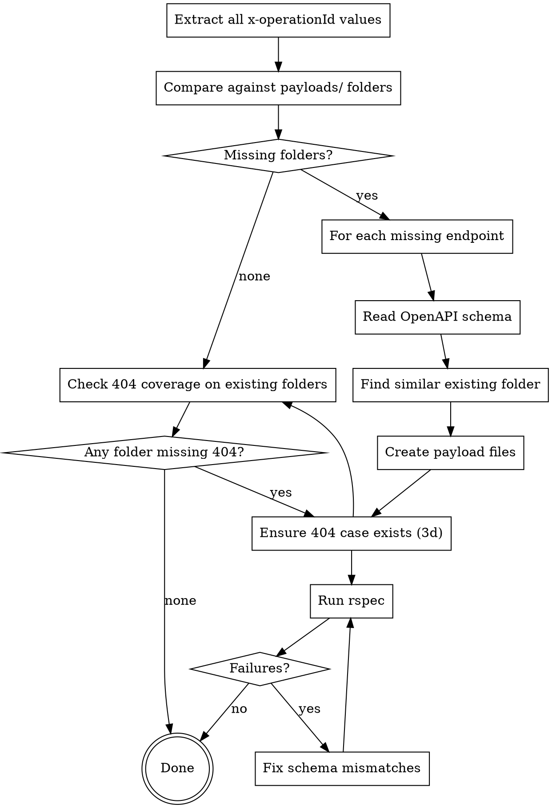

# Sync OpenAPI Specs with Staging Data Payloads

## Overview

Ensures every endpoint defined in the SIADE OpenAPI specs has a corresponding payload folder in `payloads/` with valid test cases. Finds gaps (missing folders and folders missing a 404 case), creates schema-compliant YAML files, and runs the test suite.

## When to Use

- User asks to import/sync OpenAPI files and check for missing payloads
- User asks to add staging data for new endpoints
- User asks to check coverage of payload folders against OpenAPI specs
- User asks to check 404/not-found coverage in payloads
- After new endpoints are added to the apistration/siade OpenAPI files

## Workflow



## Step 1: Locate the OpenAPI Files

The OpenAPI YAML files are generated by siade and live at the repository
root in `commons/swagger/` (visible from `mocks/` via the `mocks/commons`
symlink). Make sure they are up to date by running
`bin/generate_swagger.sh` from the `siade/` directory.

These are **generated files** (see root `CLAUDE.md`) — never hand-edit them.
If you need to change a documented response (including adding a missing
`404`, see Step 3d), edit the rswag spec in `siade/spec/requests/` and
regenerate — don't touch the YAML directly.

## Step 2: Find Missing Payload Folders

Compare all `x-operationId` values from OpenAPI files against existing `payloads/` directories:

```bash
grep -h 'x-operationId:' commons/swagger/openapi-*.yaml commons/swagger/api_particulier_open_api_static/*.yaml | sed 's/.*x-operationId: *//' | sort -u > /tmp/openapi_ids.txt
ls payloads/ | sort -u > /tmp/payload_dirs.txt
comm -23 /tmp/openapi_ids.txt /tmp/payload_dirs.txt
```

Ignore malformed operation IDs (e.g. `api_entreprise_vrivileges_`).

### Also Check 404 Coverage on Folders That Already Exist

A folder can exist and still be incomplete — check separately whether every folder has at least one not-found case (`payloads/france_connect/` is not an endpoint folder and is exempt — see 3d):

```bash
find payloads -maxdepth 2 -iname '*404*' -printf '%h\n' | sed 's|^payloads/||' | sort -u > /tmp/with_404.txt
ls payloads/ | grep -v '^france_connect$' | sort -u > /tmp/all_dirs.txt
comm -23 /tmp/all_dirs.txt /tmp/with_404.txt
```

Any folder listed here needs a `404.yaml` — go to Step 3d for each one, even though the folder itself isn't "missing."

## Step 3: Create Missing Payload Folders

For each missing endpoint:

### 3a. Identify the OpenAPI Schema

```bash
grep -rn 'x-operationId: <operation_id>' commons/swagger/
```

Then read ~200 lines from that point to get the full response schema, including required fields, types, and enums.

### 3b. Find a Similar Existing Folder as Template

Map the missing endpoint to an existing one:

| Missing endpoint pattern | Copy from |
|--------------------------|-----------|
| `v4_*` endpoint | Corresponding `v3_*` folder (add new v4-specific fields) |
| `*_with_france_connect` | Similar `*_with_civility` folder (use FC param pattern) |
| Same provider, different endpoint | Another endpoint from the same provider |

### 3c. Create YAML Payload Files

Each folder needs **at minimum**:
- One `200.yaml` (or descriptive name) with a valid success response
- One `404.yaml` — see 3d below for how to handle this when the OpenAPI spec doesn't document 404 yet

**Critical rules:**
- Every file needs unique `params` within its folder (CLAUDE.md requirement)
- Every file must end with a newline
- Standard structure: `description`, `params`, `status`, `payload`
- Payload must be valid JSON matching the OpenAPI schema exactly

**File format:**
```yaml
---
description: 'Description of the test case'
params:
  siren: '552049447'
status: 200
payload: |-
  {
    "data": { ... },
    "links": {},
    "meta": {}
  }
```

**Parameter patterns by API type:**

| API | Common params |
|-----|--------------|
| API Entreprise | `siren`, `siret`, `siret_or_rna`, `siret_or_eori` |
| API Particulier (civility) | `nomNaissance`, `prenoms[]`, `anneeDateNaissance`, `moisDateNaissance`, `jourDateNaissance`, `sexeEtatCivil`, `codeCogInseeCommuneNaissance` |
| API Particulier (FranceConnect) | Same as civility but with `codeInseeLieuDeNaissance`, `codePaysLieuDeNaissance` |
| API Particulier (INE) | `ine` (11 alphanumeric chars) |
| API Particulier (identifiant) | `identifiant` |

**Error response pattern:**
```yaml
payload: |-
  {
    "errors": [
      {
        "code": "XXXXX",
        "title": "Entite non trouvee",
        "detail": "Description of the error.",
        "source": null,
        "meta": {
          "provider": "Provider Name"
        }
      }
    ]
  }
```

### 3d. Every Folder Needs At Least One 404 Case — No Exceptions Without Checking the Code

A `NotFoundError` is a **universal** error: every SIADE interactor can emit one regardless of whether the OpenAPI spec documents it (see `siade/spec/support/validate_response_emission_guard.rb`'s `UNIVERSAL_ERRORS`, which includes `NotFoundError` alongside the baseline network/provider errors). So a missing `404.yaml` is a gap almost every time — treat "the spec doesn't document 404" as a reason to investigate, never as a reason to skip.

1. **OpenAPI already documents `404` for this operation** (the common case — most endpoints do): read the example under `responses.'404'.content.application/json.examples` and write the payload from it, same as any other status.

2. **OpenAPI does NOT document `404`**: don't skip it. Check the endpoint's `validate_response.rb` interactor in `siade/app/interactors/<provider>/.../validate_response.rb` for a call to `resource_not_found!` (directly, or via an `http_not_found?` / empty-response check). This is almost always present. If it is:
   - Add a `response '404', ...` block to the matching rswag request spec in `siade/spec/requests/api_*/v3_and_more/**/*_spec.rb`, copying the pattern from a sibling endpoint (same provider, or the version this one was cloned from — e.g. a `v4` endpoint missing 404 should copy its `v3` counterpart's block almost verbatim). Add a WebMock "not found" stub in `siade/spec/support/provider_stubs/<provider>.rb` if one doesn't already exist for this provider.
   - Run `bundle exec rspec <that spec file>` from `siade/` and confirm it's green.
   - Regenerate the docs: run `bin/generate_swagger.sh` from `siade/` (runs the full `spec/requests/api_*/**/*_spec.rb` suite and rewrites `commons/swagger/*.yaml` — never hand-edit those files).
   - Now create the mocks payload from the newly-documented example, same as case 1.

3. **The endpoint genuinely cannot 404** (rare): skip it, but say so explicitly — don't silently omit the file. `payloads/france_connect/` is the one folder-wide exemption in this repo: it mocks FranceConnect's own token-introspection response, isn't tied to any `x-operationId`, and its own acceptance spec (`spec/acceptances/france_connect_spec.rb`) asserts every fixture is `status: 200`.

**Worked example** (from a real gap found in this repo): `api_entreprise_v3_dgfip_tva` had no documented 404, but `DGFIP::TVA::ValidateResponse#handle_data_response` calls `resource_not_found!` when the provider returns an empty `data` array — nobody had written the `response '404'` rswag block. Same root cause hit all 6 `cnous_etudiant_boursier` v4/v5 folders: their v3 counterpart documents 404 (and more), but the v4/v5 specs were cloned with only the `200` case, dropping every error response including 404.

## Step 4: Check open_api_helpers.rb

The test helper at `lib/open_api_helpers.rb` routes operation IDs to the correct OpenAPI file. If new API version prefixes are introduced, update `extract_open_api_name`:

```ruby
def extract_open_api_name(operation_id)
  base_name = File.basename(operation_id)
  if base_name.start_with?('api_particulier_v2')
    'api_particulier_v2'
  elsif base_name.start_with?('api_particulier_v3') || base_name.start_with?('api_particulier_v4')
    'api_particulier'
  else
    'api_entreprise'
  end
end
```

If a new version prefix appears (e.g. `api_particulier_v5`), add it here.

## Step 5: Run Tests and Fix

```bash
bundle exec rspec
```

Tests validate payloads against the OpenAPI files in `commons/swagger/`.

**Common validation failures:**
- Missing required fields in payload - read OpenAPI schema and add them
- Extra fields not in schema (`additionalProperties: false`) - remove them
- Wrong types (object vs array, string vs boolean) - match schema exactly
- Wrong enum values - check exact values in OpenAPI spec
- Files owned by root (from Docker) - `sudo chown $USER:$USER` them

After fixing, regenerate READMEs:

```bash
bundle exec ruby bin/generate_payload_readme.rb
```

## Parallelization Strategy

When creating many folders, use parallel agents grouped by similarity:
- API Particulier civility/FC endpoints together
- API Entreprise v4 INSEE endpoints together (batch copy from v3)
- API Entreprise misc endpoints in groups of 7-8

## Common Mistakes

- Treating "OpenAPI doesn't document 404" as "this endpoint has no not-found case" — check the siade interactor's `validate_response.rb` first; if it calls `resource_not_found!`, the spec is just missing that response block. Fix the rswag spec and regenerate, don't skip the mock (see 3d).
- Creating a `404.yaml` for a status the spec truly can't produce, without adding the matching rswag response first — the payload validation test does `path_spec['responses']['404']['content']...`, which raises on `nil` if the response block doesn't exist yet.
- Guessing payload structure instead of reading the actual OpenAPI schema
- Forgetting `additionalProperties: false` means NO extra fields allowed
- Not updating `open_api_helpers.rb` when new version prefixes appear
- Forgetting to fix root-owned files after Docker test runs
- Hand-editing `commons/swagger/*.yaml` instead of editing the rswag spec and regenerating
